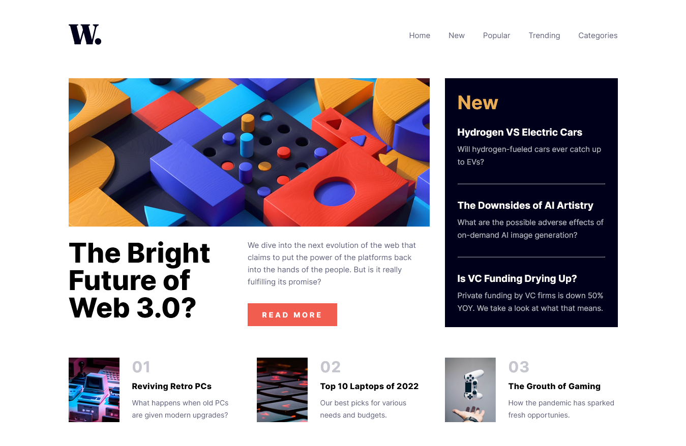
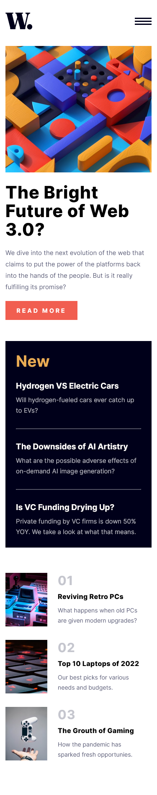

# Frontend Mentor - News homepage solution

This is a solution to the [News homepage challenge on Frontend Mentor](https://www.frontendmentor.io/challenges/news-homepage-H6SWTa1MFl). Frontend Mentor challenges help you improve your coding skills by building realistic projects. 

## Table of contents

- [Overview](#overview)
  - [The challenge](#the-challenge)
  - [Screenshot](#screenshot)
  - [Links](#links)
- [My process](#my-process)
  - [Built with](#built-with)
  - [What I learned](#what-i-learned)
  - [Continued development](#continued-development)
- [Author](#author)

## Overview

### The challenge

Users should be able to:

- View the optimal layout for the interface depending on their device's screen size
- See hover and focus states for all interactive elements on the page
- **Bonus**: Toggle the mobile menu (requires some JavaScript)

### Screenshot




### Links

- Solution URL: [Add solution URL here](https://your-solution-url.com)
- Live Site URL: [Add live site URL here](https://your-live-site-url.com)

## My process

### Built with

- Semantic HTML5 markup
- CSS custom properties
- Flexbox
- CSS Grid
- Mobile-first workflow
- Basic JavaScript


### What I learned

I learned a little bit of javascript while making the mobile menu.

```js
        window.onload = function(){
            document.querySelector(".menu-opener").addEventListener("click", function(){
                if(document.querySelector(".mobile-hidden-menu").style.display == 'block') {
                    document.querySelector(".mobile-hidden-menu").style.display = 'none';
                } else {
                    document.querySelector(".mobile-hidden-menu").style.display = 'block';
                }
            })
			document.querySelector(".menu-closer").addEventListener("click", function(){
                if(document.querySelector(".mobile-hidden-menu").style.display == 'none') {
                    document.querySelector(".mobile-hidden-menu").style.display = 'block';
                } else {
                    document.querySelector(".mobile-hidden-menu").style.display = 'none';
                }
            })
        }
```

### Continued development

I want to learn more about javascript and improve my css responsiveness skills.

## Author

- Frontend Mentor - [@nicolas055](https://www.frontendmentor.io/profile/nicolas55)
- Instagram - [nicolas_leite2](https://www.instagram.com/nicolas_leite2)